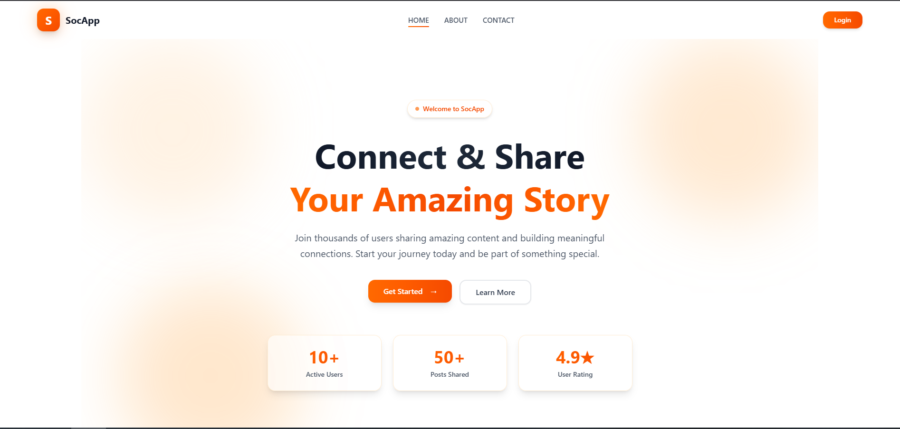
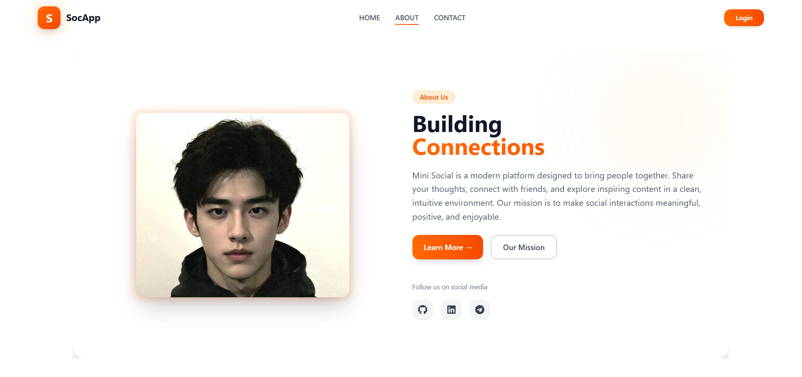
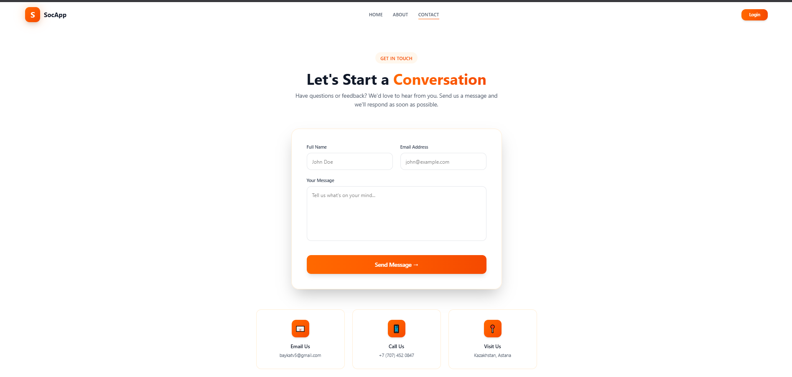
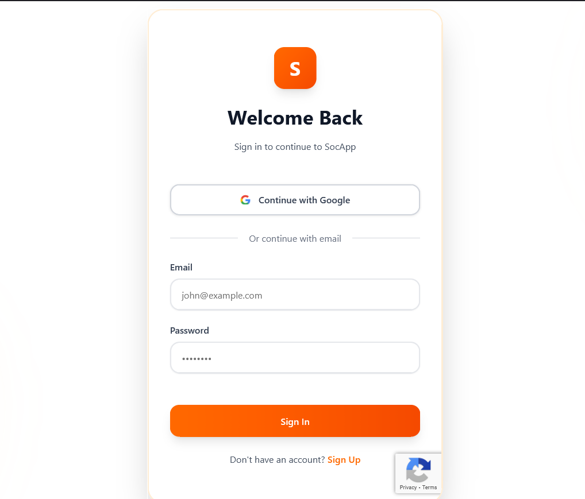
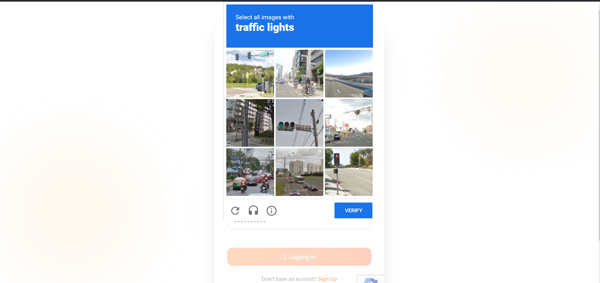
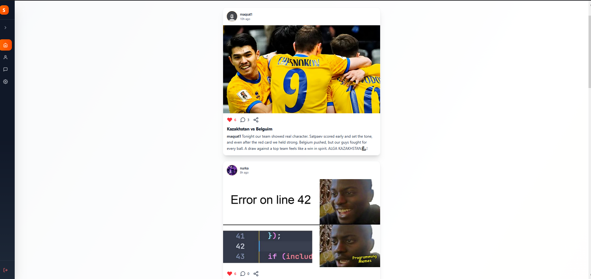
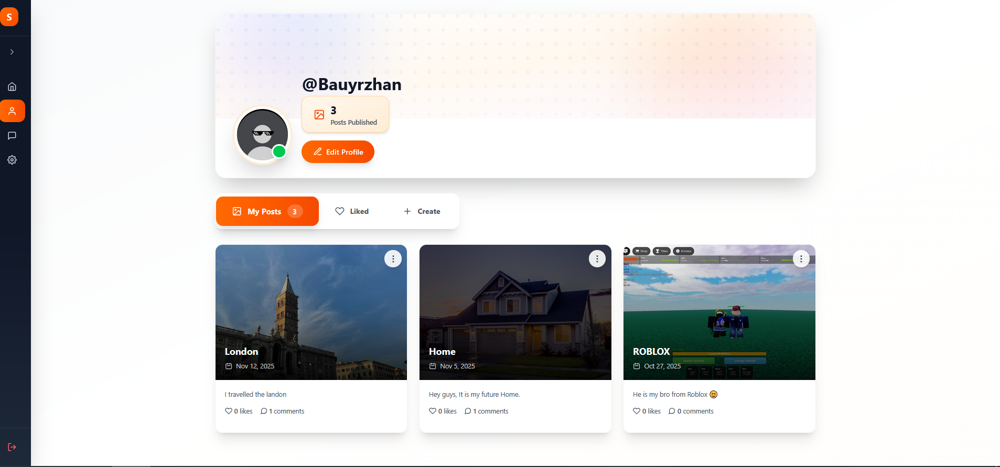
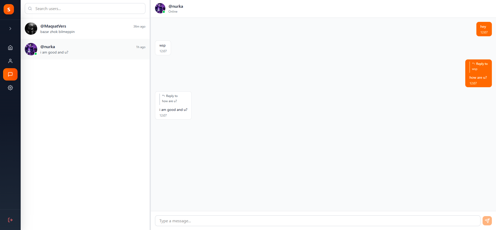
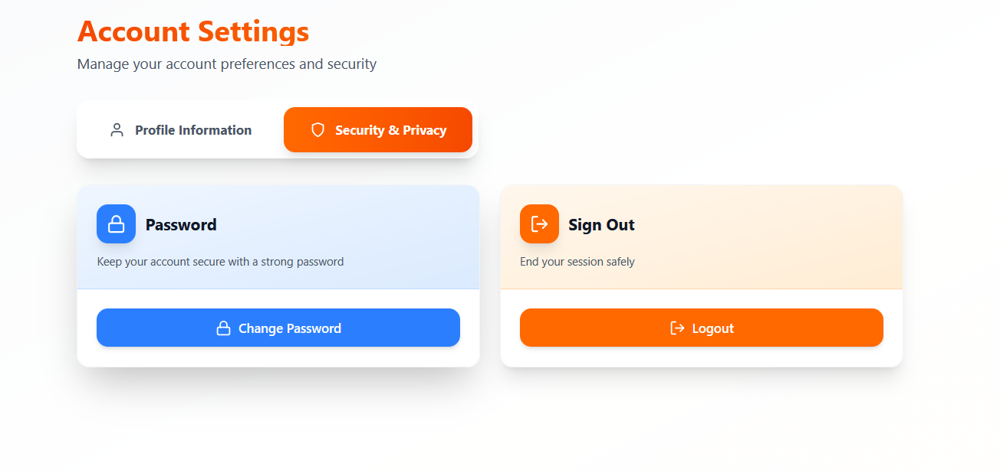
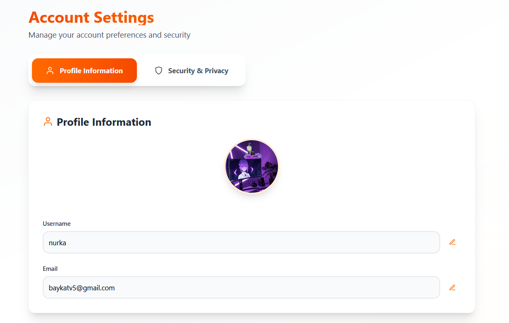

# 🌐 Social Media Platform

> A full-stack social media application with real-time messaging, post sharing, and user authentication built with React and Golang.

🌍 Live Website: http://maqsatto.tech/

[](https://reactjs.org/)
[](https://golang.org/)
[](https://www.postgresql.org/)

---

## 📋 Table of Contents

- [Overview](#overview)
- [Features](#features)
- [Screenshots](#screenshots)
- [Tech Stack](#tech-stack)
- [Architecture](#architecture)
- [Getting Started](#getting-started)
  - [Prerequisites](#prerequisites)
  - [Installation](#installation)
  - [Configuration](#configuration)
  - [Running the Application](#running-the-application)
- [Usage](#usage)
- [Contributing](#contributing)
- [Contact](#contact)

---

## 🎯 Overview

Social Media Platform is a modern, full-featured social networking application that enables users to connect, share, and communicate in real-time. Built with cutting-edge technologies, it provides a seamless experience for creating posts, engaging with content, and messaging friends.

### Key Highlights

- 🚀 Real-time messaging with WebSocket
- 🔐 Secure authentication with Google OAuth and JWT
- 📱 Responsive design for all devices
- ☁️ Cloud-based image storage
- 🐳 Docker support for easy deployment

---

## ✨ Features

### 📱 Posts & Interactions
- View, create, like, comment on, and share posts
- Interactive feed with real-time updates

### 👤 User Profiles
- Customize your profile with photo uploads
- Update account settings and change password

### 💬 Real-Time Messaging
- Search for friends and start conversations
- Instant messaging powered by WebSocket

### 🔐 Authentication
- **Manual sign up/sign in**
- **Google OAuth integration**
- **reCAPTCHA protection**
- **Password recovery** via email verification

### 📧 Contact Form
- Submit questions or feedback directly through the platform

---

## 🎬 Demo

### Video Demos

- **🏠 Landing Page:** [Watch on YouTube](https://youtu.be/B2iaL2uM9wE)
- **🔐 Login Page:** [Watch on YouTube](https://youtu.be/nVSN5ZDLV0U)
- **📱 Feed Page:** [Watch on YouTube](https://youtu.be/B-8JBJ7ndmY)
- **👤 Profile Page:** [Watch on YouTube](https://youtu.be/8Fi9IV9L83Q)
- **💬 Chat Page:** [Watch on YouTube](https://youtube.com/shorts/Wfy7xy6nSyA)
- **⚙️ Settings Page:** [Watch on YouTube](https://youtu.be/Fiy8WJLaqoc)

---

## 📸 Screenshots

### Home Page


### About Page


### Contact Page


### Login & Authentication


### reCAPTCHA Protection


### Main Feed


### User Profile


### Real-Time Chat


### Settings



---

## 🛠️ Tech Stack

### Frontend
| Technology | Purpose |
|------------|---------|
| **React** | UI Library |
| **Tailwind CSS** | Styling Framework |
| **Shadcn UI** | Component Library |
| **Vite** | Build Tool |

### Backend
| Technology | Purpose |
|------------|---------|
| **Golang** | Server Language |
| **Gin** | Web Framework |
| **WebSocket** | Real-time Communication |
| **JWT** | Authentication |

### Database & Infrastructure
| Technology | Purpose |
|------------|---------|
| **PostgreSQL** | Primary Database |
| **Docker** | Containerization |
| **Nginx** | Reverse Proxy |

### Third-Party Services
| Service | Purpose |
|---------|---------|
| **Cloudinary** | Image Hosting |
| **Mailtrap** | Email Testing |
| **Gomail** | Email Delivery |
| **Google OAuth** | Social Authentication |
| **reCAPTCHA** | Bot Protection |

---

## 🏗️ Architecture

```
SocialApp/
├── client/                 # React frontend
│   ├── src/
│   │   ├── components/    # React components
│   │   ├── pages/         # Page components
│   │   ├── services/      # API services
│   │   └── utils/         # Utility functions
│   ├── .env               # Frontend environment variables
│   └── package.json
│
├── server/                # Golang backend
│   ├── cmd/              # Application entry point
│   ├── internal/         # Internal packages
│   │   ├── handlers/    # HTTP handlers
│   │   ├── models/      # Data models
│   │   ├── services/    # Business logic
│   │   └── middleware/  # Middleware functions
│   ├── .env             # Backend environment variables
│   └── go.mod
│
├── docker-compose.yml    # Docker configuration
└── README.md            # This file
```

---

## 🚀 Getting Started

### Prerequisites

Before you begin, ensure you have the following installed:

- **Node.js** (v16.x or higher) - [Download](https://nodejs.org/)
- **npm** or **yarn** - Comes with Node.js
- **Go** (v1.19 or higher) - [Download](https://golang.org/)
- **PostgreSQL** (v13 or higher) - [Download](https://www.postgresql.org/)
- **Docker Desktop** (optional) - [Download](https://www.docker.com/)

### Installation

1. **Clone the repository**

```bash
mkdir folder_name
cd folder_name
git clone https://github.com/MaqsattoTeam/SocialApp
cd SocialApp
```

2. **Install dependencies**

**Frontend:**
```bash
cd client
npm install
```

**Backend:**
```bash
cd server
go mod download
```

### Configuration

#### 1. Frontend Environment Variables

Create a `.env` file in the `client` directory:

```env
VITE_API_URL=http://localhost:8080
VITE_GOOGLE_CLIENT_ID=your_google_client_id
VITE_RECAPTCHA_SITE_KEY=your_recaptcha_site_key
```

#### 2. Backend Environment Variables

Create a `.env` file in the `server` directory:

```env
JWT_SECRET=your_jwt_secret_key
PORT=8080
DSN=your_postgresql_connection_string
CLOUDINARY_URL=your_cloudinary_url
GOOGLE_CLIENT_ID=your_google_client_id
GOOGLE_CLIENT_SECRET=your_google_client_secret
GOOGLE_REDIRECT_URL=your_google_redirect_url
RECAPTCHA_SECRET_KEY=your_recaptcha_secret_key
MAILTRAP_TOKEN=your_mailtrap_token
SMTP_HOST=smtp.gmail.com
SMTP_PORT=587
SMTP_USER=your_email@gmail.com
SMTP_PASSWORD=your_16_character_app_password
```

#### 3. Database Setup

Create a PostgreSQL database:

```sql
CREATE DATABASE socialapp;
```

The application will automatically run migrations on startup.

### Running the Application

#### Option 1: Manual Setup (Development)

**Terminal 1 - Start Frontend:**
```bash
cd client
npm run dev
```
Frontend will run on: http://localhost:5173

**Terminal 2 - Start Backend:**
```bash
cd server
air  # Hot reload (recommended)
```
Or without hot reload:
```bash
cd server/cmd
go run main.go
```
Backend will run on: http://localhost:8080

#### Option 2: Docker Setup 🐳

If you have Docker Desktop installed:

```bash
docker compose pull
docker compose up
```

This will start:
- Frontend: http://localhost:3000
- Backend: http://localhost:8080
- PostgreSQL: http://localhost:5432

To stop:
```bash
docker compose down
```

---

## 🤝 Contributing

Contributions are welcome! Please feel free to submit a Pull Request.

1. **Fork the repository**
2. **Create a feature branch**
   ```bash
   git checkout -b feature/AmazingFeature
   ```
3. **Commit your changes**
   ```bash
   git commit -m 'Add some AmazingFeature'
   ```
4. **Push to the branch**
   ```bash
   git push origin feature/AmazingFeature
   ```
5. **Open a Pull Request**

---

## 📞 Contact

**MaqsattoTeam**

- GitHub: [@MaqsattoTeam](https://github.com/MaqsattoTeam)
- Project Link: [https://github.com/MaqsattoTeam/SocialApp](https://github.com/MaqsattoTeam/SocialApp)

For questions or feedback, use the contact form within the application or reach out to the team.

---

## ⚠️ Important Notes

### Security
- **Never commit `.env` files** to version control
- Use strong, unique values for `JWT_SECRET`
- Enable 2FA for production Google OAuth

### Email Setup
- For Gmail SMTP, generate an [App Password](https://support.google.com/accounts/answer/185833)
- Use Mailtrap for development/testing
- Switch to production SMTP for deployment

### Database
- Ensure PostgreSQL is running before starting the backend
- Database migrations run automatically on startup
- Backup your database regularly

---

<div align="center">

**⭐ Star this repository if you find it helpful!**

Made with ❤️ by [ApexTeam](https://github.com/ApexTeam)

</div>
